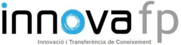
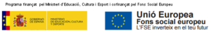

# Projectes

## InnovaFP

InnovaFP és el programa de la Direcció General de Formació Professional i Ensenyaments de Règim Especial del Departament d’Ensenyament de la Generalitat de Catalunya que promou la col·laboració d’empreses i centres de formació professional per treballar en projectes d’innovació i transferència de coneixement. Per això aprofita els coneixements, competències i capacitats d’alumnes i professors de Formació Professional de Catalunya per ajudar, a les empreses, especialment a micro i petites empreses, així com a emprenedors, a tirar endavant petits projectes d’innovació o transferència de coneixement que d’altra manera difícilment veurien la llum.

Ací podeu trobar més informació  [InnovaFP](http://www.innovafp.cat/innovafp/).

## Emprenedoria

El programa Xarxa d’Emprenedoria vol dirigir-se a alumnat, professorat i centres que imparteixen Formació Professional, acompanyant i donant suport en la implantació i desenvolupament d’ estratègies metodològiques que promoguin capacitats d’emprenedoria i de creació d’empreses d’autoocupació. Entre els objectius de la xarxa d’enguany destaquen: participar en activitats de cultura emprenedora, consolidar el concurs de projectes d’idees de negoci, mantenir de la xarxa d’assessorament d’emprenedoria i compatir bones pràctiques entre els centres docents participants.

Podeu trobar més informació al següent enllaç Odissea: [Emprenedoria](https://odissea.xtec.cat/).

{{footer.md}}